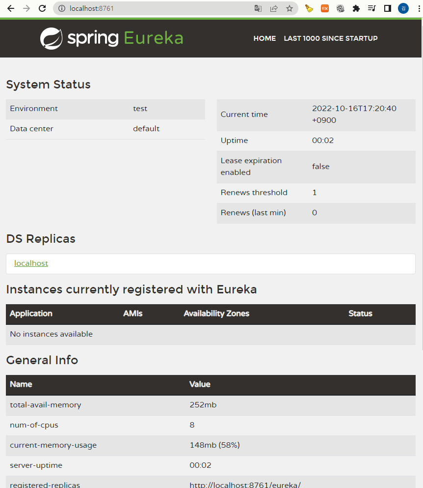

# SpringCloudMSA
spring cloud를 이용하여 MSA를 개발해보자  

> 목차

🟣 MSA와 Spring Cloud의 개념

1. [Monolith vs MSA](#monolith-vs-msa)
2. [Cloud Native Architecture의 이해](#cloud-native-architecture-의-이해)
3. [Cloud Native Application의 이해](#cloud-native-application-의-이해)
4. [SOA와 MSA차이](#soa와-msa차이)
5. [RESTful Web Service](#restful-web-service)
6. [MSA 표준 구성요소](#msa-표준-구성요소)
7. [MSA 기반 기술](#msa-기반-기술)
8. [Spring Cloud란 무엇일까?](#spring-cloud란-무엇일까)
9. [Spring Cloud 구성요소](#spring-cloud-구성요소)
10. [실습에 사용할 Spring Cloud Project](#실습에-사용할-spring-cloud-project)

🟣 Service Discovery

1. [Spring Cloud Netflix Eureka](#spring-cloud-netflix-eureka)
2. [Spring Cloud Netflix Eureka 서버 셋팅](#spring-cloud-netflix-eureka-서버-셋팅)
3. [Spring Cloud Netflix Eureka client 프로젝트 생성](#spring-cloud-netflix-eureka-client-예제-프로젝트-생성)

🟣 API Gateway Service

1. [API Gateway Service 특징](#api-gateway-service-특징)
2. [Netflix Ribbon과 Zuul](#netflix-ribbon과-zuul)
3. [Spring Cloud Gateway](#spring-cloud-gateway)
4. [Spring Cloud Gateway Filter](spring-cloud-gateway-filter)


<!--
- 마이크로 서비스 특징
- 자바와 프레임워크인 스프링을 이용하여 MSA를 개발
- 스프링 클라우드 개념
- 스프링 부트와 스프링 클라우드 프레임워크를 활용하여 MSA를 개발하는 방법
- 클라우드 네이티브
- 클라우드 인프라에서 운영하기 위해 필요한 핵심적인 개념
- 컨테이너 가상화 기술인 도커에 배포예정-->

#
<br>

<!-------------- 1-1. MSA란 무엇일까 (Monolith vs MSA) --------------------------------->

# 🟣 MSA와 Spring Cloud의 개념
# Monolith vs MSA

어플리케이션을 개발하기 위해서는 여러가지 방법론들이 존재한다.  

### ✔ Monolith 방식 (기존에 많이 사용하는 방식)  
 - DATABASE로직, 비지니스 로직, 프론트 등 모든 것이 하나로 연결되어 패키징 되어있는 방식이다.
 - 어플리케이션 안에서 제공되는 각각의 서비스(ex. 가입, 주문, 결제 등..)들은 하나로 묶여서 배포된다.
 - 연결된 DATABASE 역시 하나의 DATABASE안에 모든 테이블들이 존재한다.
  
❗ 단점  
  - 수정사항이 하나라도 있을 시에 프로젝트 전체를 다시 빌드-테스트-배포
  - 오류 발생시 어플리케이션 전체가 다운되어버리는 현상이 발생되기도 한다.

### ✔ MSA 방식 

MSA(Microservice Architecture)는 [클라우드 네이티브 아키텍쳐](#cloud-native-architecture-의-이해)의 핵심 요소 중에 하나이다.

 - 쪼개진 서비스들의 묶음들이 하나의 application을 구성한다. (http 통신)
 - 비지니스들을 중심으로 구축되어야하며 자동화된 배포시스템을 가져야한다 (CI/CD)
 - 수정 배포시에 다른서비스에 영향을 주지않거나 최소한으로 영향을 줌
 - 쪼개진 서비스들은 서로 다른 언어와 서로 다른 database를 가질 수 있다.
 - 설정정보는 외부에 두어 관리하는 것을 권장
 - DB가 다를경우 kafka 메세징 서비스를 이용하여 동기화 가능.  
   어떠한 데이터 등록 -> 그 데이터에 관심이 있다고 등록(서브 스크라이버)을 한 객체에 데이터를 배달해주는 서비스 -> 그리고 자신의 데이터에 등록

<br>


<!--------------------- 1-2. Cloud Native Architecture 의 이해 ---------------------------------------->

# Cloud Native Architecture 의 이해

**"Cloud Native Architecture란 클라우드 환경의 장점을 활용하여 서비스를 구축하는 것"**

### 😐 클라우드 네이티브 아키텍쳐 도입 전 방식
 - 물리적 하드웨어 성능에 따라서 애플리케이션 서비스 제공
 - 서버가 고정되어 있으니 서버의 증축이나 환경설정 변경이 어려움
 - 물론 지금도 이렇게 서비스를 운영하는 곳은 많음
   
➡ 그래서 탄력적으로 사용할 수 있도록 도입된게 클라우드 환경이다.

### 🥰 클라우드 네이티브 아키텍쳐 특징
 - 리소스를 유연하게 사용 가능함 (가상의 서버, 스토리지, 네트워크를 사용한 만큼 비용처리)
 - 시스템 확장이 유연함. 더 많은 사용자 요청을 처리 가능. 시스템 부하를 분산시킴
 - 컨테이너 기반 패키지
 - 분리되어 개발된 서비스를 CI/CD 자동화 파이프라인을 통해서 서비스 생성-통합-배포 시간을 단축
 - MSA 서비스 구조 (서비스들의 종속성을 최소화 하도록 하자)
 - 디스커버리 서비스에 등록되고 삭제된다.
 - 특정 서비스에 오류가 발생해도 다른 서비스에 영향을 최소화한다.
  
<br>

<!--------------------- 1-3. Cloud Native Application 의 이해 ---------------------------------------->

# Cloud Native Application 의 이해

**"Cloud Native Architecture 환경에 의해 설계되고 구현된 어플리케이션"**

클라우드 네이티브 어플리케이션 특징

<details>
<summary>DevOps</summary>

<br>

- 개발조직과 운영조직의 통합.  
- 오류 개선사항을 필요할 때마다 바로바로 수정 반영할 수 있도록 한다.  
- 서비스의 구조를 작게 분할하여 더 자주 테스트, 배포할 수 있도록 한다.  
- 구현-테스트-배포 시스템 종료될때까지 반복 (문제 발생시 바로 재 배포하는 과정을 반복 가능)
</details>
<details>
<summary>CI/CD</summary>


<br>

- CI(지속적인 통합. Jenkins, Team CI, Travis CI)  
- CD(지속적인 배포. 카나리 배포 블루그린 배포)  
</details>
<details>
<summary>Container 가상화</summary>


<br>

- 전통적인 방식 : 하드웨어 위에 OS를 설치하고 Application들을 운영함  
- 가상머신 방식 : OS위에 Hypervisor기술을 통하여 각각의 가상머신을 기동. (하드웨어를 쪼개서 사용하는 방식)  
- 컨테이너 가상화 방식 : OS위에 컨테이너(Docker)를 이용하여 Application들을 운영  
</details>
<details>
<summary>Microservices</summary>

<br>
하나의 서버에 하나의 서비스를 올리고 그 서비스들이 모여서 Application을 이룬다.
</details>

<br>

<!--------------------- 1-4. SOA와 MSA차이 ---------------------------------------->

# SOA와 MSA차이

서비스를 지향한다는 점에서 공통점이 있다.  
서비스 공유를 어디까지 하느냐에 따라 달라지게 된다.  

### ✔ SOA (Service Oriented Architecture)
- 서비스 공유 최대화
- 서비스 재사용을 통하여 비용 절감을 중점으로 둔다.
- 엔터프라이즈 서비스 버스(ESB)라는 개념을 통하여 서비스를 한대 모아서 비지니스를 제공함
- Web Services를 통하여 제공 : WSDL(XML 기반 서비스 설명하는 표준 스팩)
- REST / SOAP 등으로 통신

### ✔ MSA (Microservice Architecture)
- 서비스 공유 최소화
- 서비스의 결합도를 낮추어 변화에 능동적으로 대응한다는것에 중점을 둔다.
- REST API를 통하여 데이터나 서비스에 접근가능
- [위에 정리해둔 내용..](#monolith-vs-msa)

<br>

<!--------------------- 1-5. RESTful Web Service ---------------------------------------->

# RESTful Web Service

- LEVEL 0 : 가장 간단한 URI 매핑한 상태
- LEVEL 1 : 리소스를 URI로 적절하게 나타내는 상태 ex) https://server/users/2
- LEVEL 2 : LEVEL1 + HTTP METHOD (리소스를 CRUD 용도에 맞게 설계함, get/post/put/delete)
- LEVEL 3 : LEVEL2 + HATEOAS (다음 호출에 대한 정보를 넘겨줌)

<br>

<!--------------------- 1-6.  MSA 표준 구성요소---------------------------------------->

# MSA 표준 구성요소

<br>


<br>

1. 클라이언트나 다른 서비스들은 **External Gateway**(진입점)을 통해서 필요한 서비스를 요청을 한다.
2. 요청은 **Service Router**로 전달이 되고, 서비스들이 등록되어있는 **Service Discovery**를 통하여 서비스 위치를 검색한다.
3. 여러개의 분산된 서버로 구성이 되어있다면 **Load Balancing**을 통하여 어떤 서비스로 보내질지 결정이 된다.
4. 마이크로 서비스는 컨테이너 가상화 기술(**Container Management**)을 통하여 구성되어있다.
5. CI/CD를 통하여 외부에있는 시스템에 배포 진행시 DevOps 관리자가 존재한다.
6. **Backing Services**에는 Persistence(저장스토리지를 모아서 사용)와 MOM(메세징 처리 시스템을 통하여 서비스들을 연결시켜줌)이 존재한다.
7. **Telemetry**에는 모니터링(Monitoring)과 진단기능(Diagnostics)을 가지고있다.

* 환경설정의 경우 외부시스템(Congif Store)에 저장한다.

👉 **Service Mesh**에 대하여 조금 더 알아 보자.
- Service Mesh는 이미지 상단에 Service Discovery와 Service Router.. 등 으로 묶여있는 부분이다.
- MSA를 적용한 시스템의 내부 통신부분을 이야기한다.
- 서비스간의 통신을 추상화 하고 빠르고 신뢰성 있게 만들어주는 인프라 스트럭쳐의 레이어라고 볼 수 있다.
- 복잡한 내부 네트워크를 제어하고 추적하고 내부 네트워크에 관련된 로직을 추가한다.
- URI경로, 호스트 헤더, API 버전, 기타 응용프로그램 규칙을 기반으로 하는 네트워크 레이어이다.
- 경량화 프록시를 통하여 다양한 라우팅 기능이라던가 공통기능을 설정할 수 있다.
- 설정정보, 라우팅, 인증, 로드발랜싱, 탄력성, 검색, 암호화 등의 서비스들을 통하여 MSA 개발과 운영을 지원한다.
- 추상적인 개념이며 Service Mesh 계층에서 다양한 기능과 MSA 운영을 효율성있게 제공하는 것에 목적이 있다.

<br>

👉 MSA 구성 가이드 참고 URL (CNCF)  
- [http://landscape.cncf.io](https://landscape.cncf.io)

<br>

<!--------------------- 1-7. MSA 기반 기술---------------------------------------->
# MSA 기반 기술

🔸 **Gateway**  
NGINX, KONG, Zuul, apigee  

🔸 **Service Mesh**  
Istio, envoy, Zookeeper, Consul  

🔸 **Runtime**(운영환경)  
최신트렌드인 클라우드 서비스, 컨테이너 가상화기술  
doker, kubernetes  

🔸 **Frameworks**(언어와 플랫폼)  
Spring Boot, Spring Cloud  

🔸 **Backing Services**  
데이타베이스 관련된 기술, NoSQL, 메세징 서비스 등..  
RabbitMQ, kafka, redis

🔸 **Automation(CI/CD..)**  
Jenkins, maven, gradle  

🔸 **Telemetry**  
마이크로 서비스의 현재 상태를 모니터링  
elastic, DATADOG

<br>

<!--------------------- 1-8. Spring Cloud---------------------------------------->

# Spring Cloud란 무엇일까

[https://spring.io/projects/spring-cloud](https://spring.io/projects/spring-cloud)

- MSA 지원하기 위한 프레임워크
- 독립적으로 개발하기 위한 서비스
- 다양한 하위 프로젝트들을 가지고 있다.
- 환경설정, 서비스검색, 라우팅, 프록시 등 서비스를 사용함에 있어서 필요한 분산 시스템을 빠르게 어플리케이션에 접목시키기 위한 서비스
- Spring Cloud를 사용하기 위해서는 Spring Boot가 필요하다.

<br>

<!--------------------- 1-9. Spring Cloud 구성요소---------------------------------------->

# Spring Cloud 구성요소

🔸 **환경설정관리(Spring Cloud Config Server)**  
  Gateway IP, token 정보 등 서비스에서 공통으로 사용하는 환경설정 정보를 Spring Clouod Config Server를 통하여 외부 저장소에 저장한다.  
  
🔸 **Location transparency**  
  서비스의 등록과 위치정보 확인과 같은 서비스를 위해서  Netflix의 Eureka Server(Naming Server)를 이용  
  NamingServer에 서비스를 등록하여 위치를 검색하는 용도로 사용  
  
🔸 **요청정보 분산(Load Distribution - Load Balancing)**  
  외부에서 요청이 들어오면 NamingServer확인 후, 요청 서비스로 진입시켜주는 진입문  
  Spring Cloud Gateway, Ribbon  

🔸 **Easier REST Clients**  
  각각의 MicroService 통신을 위해 Feign Client를 이용하여 호출
  
🔸 **시각화 모니터링, 로그 추적(Visibility and Monitoring)**
  Zipkin Distributed Tracing, Netflix API gateway  
  
🔸 **Fault Tolerance**  
  장애 발생 시 빠르게 복구하기 위한 서비스  
  Hystrix


<br>
<!--------------------- 1-10. 실습에 사용 할 Spring Cloud Project----------------------------------->

# 실습에 사용할 Spring Cloud Project

 - Spring Cloud Config
 - Spring Cloud Netflix
 - Spring Cloud Security
 - Spring Cloud Sleuth
 - Spring Cloud Starters
 - Spring Cloud Gateway
 - Spring Cloud OpenFeign

#
# 🟣 Service Discovery

<!--------------------- 2-1. Spring Cloud Netflix Eureka----------------------------------->

# Spring Cloud Netflix Eureka

하나의 Service가 3개의 instance를 가지고 있다고 가정해보자. (일종의 로드밸런스)
PC가 하나일 경우에는 PORT 3개로 분산시킨다.  

 - http://localhost:8080
 - http://localhost:8081
 - http://localhost:8082

만약 PC가 여러개일 경우에는 같은 포트로 구성이 가능하다.  

 - http://server1:8080
 - http://server2:8080
 - http://server3:8080

🤔 **그래서? Spring Cloud Netflix Eureka가 하는 역할은?**  

모든 마이크로 서비스를 등록하는 곳!  
각각의 마이크로 서비스가 어느 서버에 존재하는지 **저장**된다.  
요청정보가 들어왔을 때 서비스를 **검색**하기 위하여 사용되는 개념이다.  
이런 역할을 **Service Discovery**라고 한다.  

Client - Load Balancer(API Gateway) - ServiceDiscovery(Eureka) - Services....  
클라이언트가 필요한 서비스를 Gateway에 요청하고, Gateway는 ServiceDiscovery를 통하여 요청된 서비스가 어디에 있는지 알아낸다. 그리고 사용자 요청정보가 서비스에 도달한다.

<br>


<!--------------------- 2-2. Spring Cloud Netflix Eureka 셋팅------------------------------------>

# Spring Cloud Netflix Eureka 서버 셋팅

서비스 디스커버리 역할을 하는 Eureka 서버를 셋팅하고 실행해보자.

IntelliJ 버전 : 2022.2.3  
JDK 버전 : jdk-11.0.15  
Spring Boot 버전 : 2.7.4  

IntelliJ를 이용하여 Create New Project - Spring Initializr를 통하여 Boot Project 생성  
Dependencies에 Spring Cloud Discovery - Eureka Server 추가  

서비스 디스커버리 역할만을 하기 위한 Eureka 서버이기 때문에 다른 Dependency는 추가하지 않는다.   


### 🔹 **프로젝트 생성시 pom.xml은 자동으로 생성된다 ! dependency가 잘 들어갔나 확인해보자.**  

> maven 프로젝트 경우에는 pom.xml 생성된다.  
> gradle 프로젝트 경우에는 build 생성된다.  

**[pom.xml]**

``` xml
<?xml version="1.0" encoding="UTF-8"?>
<project xmlns="http://maven.apache.org/POM/4.0.0" xmlns:xsi="http://www.w3.org/2001/XMLSchema-instance"
         xsi:schemaLocation="http://maven.apache.org/POM/4.0.0 https://maven.apache.org/xsd/maven-4.0.0.xsd">
    <modelVersion>4.0.0</modelVersion>
    <parent>
        <groupId>org.springframework.boot</groupId>
        <artifactId>spring-boot-starter-parent</artifactId>
        <version>2.7.4</version>
        <relativePath/> <!-- lookup parent from repository -->
    </parent>
    <groupId>com.example</groupId>
    <artifactId>discovery-service</artifactId>
    <version>0.0.1-SNAPSHOT</version>
    <name>discovery-service</name>
    <description>discovery-service</description>
    <properties>
        <java.version>11</java.version>
        <spring-cloud.version>2021.0.4</spring-cloud.version>
    </properties>
    <dependencies>
        <dependency>
            <groupId>org.springframework.cloud</groupId>
            <artifactId>spring-cloud-starter-netflix-eureka-server</artifactId>
        </dependency>

        <dependency>
            <groupId>org.springframework.boot</groupId>
            <artifactId>spring-boot-starter-test</artifactId>
            <scope>test</scope>
        </dependency>
    </dependencies>
    <dependencyManagement>
        <dependencies>
            <dependency>
                <groupId>org.springframework.cloud</groupId>
                <artifactId>spring-cloud-dependencies</artifactId>
                <version>${spring-cloud.version}</version>
                <type>pom</type>
                <scope>import</scope>
            </dependency>
        </dependencies>
    </dependencyManagement>

    <build>
        <plugins>
            <plugin>
                <groupId>org.springframework.boot</groupId>
                <artifactId>spring-boot-maven-plugin</artifactId>
            </plugin>
        </plugins>
    </build>

</project>


```


### 🔹 **Eureka 서버라고 지정해 주자 !**

> 메인클래스에 @EnableEurekaServer 어노테이션을 추가하여 프로젝트가 Eureka 서버라고 지정해준다.  

**[DiscoveryserviceApplication.java]**

``` java
package com.example.discoveryservice;

import org.springframework.boot.SpringApplication;
import org.springframework.boot.autoconfigure.SpringBootApplication;
import org.springframework.cloud.netflix.eureka.server.EnableEurekaServer;

@SpringBootApplication
@EnableEurekaServer
public class DiscoveryServiceApplication {

    public static void main(String[] args) {
        SpringApplication.run(DiscoveryServiceApplication.class, args);
    }

}


```

### 🔹 **Application.yml 파일에 유레카 서버정보를 셋팅하자!**

스프링부트 프로젝트 초기에 application.properties파일을 yml파일로 바꾸어주자.  
properties를 그냥 써도 되긴 함.  

**[application.yml]**

1. 서버 포트번호 설정 : 유레카는 웹 서비스 성격으로 구동되기 때문에 포트를 설정
2. application-name 설정 : 마이크로 서비스의 고유 아이디 부여
3. eureka client 설정 : 현재 우리가 만드는건 서버인데 왜 유레카 클라이언트 설정을 해야하는가?  
유레카 라이브러리가 포함된 채 스프링부트가 기동이 되면 자동으로 서비스 정보가 등록이 된다.(default가 true임)
하지만 지금은 서버 설정하는 부분이기 때문에 false로 설정하여 자기자신(서버)의 정보는 등록되지 않도록 해준다.
걍 서버로서 기동만 되면 된다.

``` yml
server:
  port: 8761
  
spring:
  application:
    name: discoveryservice
    
eureka:
  client:
    register-with-eureka: false
    fetch-registry: false
```

http://localhost:8761를 띄워보면 Eureka Dashboard를 볼 수 있다.



<br>

<!--------------------- 2-3.  Eureka client 예제 프로젝트 생성
---------------------------------------->

# Spring Cloud Netflix Eureka client 예제 프로젝트 생성

클라이언트가 서비스 요청시에 어디에 서비스가 등록되어있는지 알 수 있는 Service Discovery(Eureka)서버를 만들어 보았다.  
이제는 Discovery 서버에 등록 될 API 서버(클라이언트 서버)를 간단히 만들어보자!  
아래 방법은 서비스마다 PORT번호를 부여해주는 방식이다.  
랜덤으로 포트를 지정하는 방법도 있다.

### USER-SERVICE API 생성 (Client)

IntelliJ 버전 : 2022.2.3  
JDK 버전 : jdk-11.0.15  
Spring Boot 버전 : 2.7.4  

IntelliJ를 이용하여 Create New Project - Spring Initializr를 통하여 Boot Project 생성  

**추가 할 Dependencies**
- Eureka Discovery Client
- Spring Boot DevTools
- Lombok
- Spring Web

### 🔹 **USER-SERVICE 프로젝트를 Eureka 클라이언트 서버로 지정해 주자 !**  

> 메인클래스에 @EnableDiscoveryClient 어노테이션을 추가하여 프로젝트 Eureka 클라이언트 서버로 지정해준다.  

**[UserServiceApplication.java]**

``` java
package com.example.userservice;

import org.springframework.boot.SpringApplication;
import org.springframework.boot.autoconfigure.SpringBootApplication;
import org.springframework.cloud.client.discovery.EnableDiscoveryClient;
import org.springframework.cloud.netflix.eureka.EnableEurekaClient;

@SpringBootApplication
@EnableDiscoveryClient
public class UserServiceApplication {

    public static void main(String[] args) {
        SpringApplication.run(UserServiceApplication.class, args);
    }

}

```

### 🔹 **Application.yml 파일에 유레카 클라이언트 정보를 셋팅하자!**  

스프링부트 프로젝트 초기에 application.properties파일을 yml파일로 바꾸어주자.  
properties를 그냥 써도 되긴 함.  

**[application.yml]**

1. 서버 포트번호 설정 : 9001로 지정 (임의로 지정함)
2. application-name 설정 : 마이크로 서비스의 고유 아이디 부여
3. eureka client 설정 : true로 설정하면 eureka 서버로부터 인스턴스들의 정보를 주기적으로 가져온다. 갱신 된 정보를 받겠다는 것이다.  

``` yml
server:
  port: 9001
  
spring:
  application:
    name: user-service
    
eureka:
  client:
    register-with-eureka: true
    fetch-registry: true
    service-url:
      defaultZone: http://127.0.0.1:8761/eureka

```

> 성공적으로 USER-SERVICE가 등록이 되었다면 유레카 서버에 9001 서비스가 하나 올라온 것을 볼 수 있다.


> 서버 실행 후 Eureka에서 localhost가 아닌 DESKTOP-JED000I 이런식으로 본인 컴퓨터의 호스트이름이 노출되고있다.
이럴때는 application.yml에 eureka.instance.instance-id 설정을 따로 해주면 된다.  

```yml
eureka:
  instance:
    prefer-ip-address: true
    instance-id: ${spring.application.name}:${spring.application.instance_id:${server.port}}
```


> 아래와 같은 에러가 발생했다면 유레카 서버를 켰는지 확인해보자.  
> 유레카 서버의 포트번호를 8761로 설정했는지 확인해보자.  

```Request execution error. endpoint=DefaultEndpoint{ serviceUrl='http://localhost:8761/eureka/}, exception=I/O error on GET request for "http://localhost:8761/eureka/apps/": Connect to localhost:8761 [localhost/127.0.0.1, localhost/0:0:0:0:0:0:0:1] failed: Connection refused: connect....```


### 🔹 **서비스를 더 추가해보자 !**  

✅ 서비스를 추가 하는 방법 1  

기존에 만든 userServiceApplication을 복제해서 서비스를 하나 더 만든다.  
기존에 user-service 포트와 겹치지 않도록 포트번호 9002로 설정해주고 userServiceApplication2를 실행해준다.  


> USER-SERVICE가 2개가 올라간 것을 볼 수 있다. UP {2} - 9001, 9002


✅ 서비스를 추가 하는 방법 2  

인텔리제이 terminal에서 mvn 명령어를 이용하여 서비스를 하나 더 추가한다.
``` 
mvn spring-boot:run -Dspring-boot.run.jvmArguments='-Dserver.port=9003'
```


✅ 서비스를 추가 하는 방법 3  

user-service 폴더의 위치로 이동하여 명령어를 실행한다.  
target에 jar파일이 생성시킨 뒤 jar파일을 실행해준다.  

``` 
> cd [작업경로]/user-service
> mvn clean
> mvn compile package
> java -jar -Dserver.port=9004 ./target/user-service-0.0.1-SNAPSHOT.jar
```

### 🔹 Eureka Client 랜덤포트 설정

**[application.yml]**

server-port를 0으로 설정하면 랜덤으로 포트번호가 할당된다.  
port를 0으로 지정하면 서비스를 여러개 올리더라도 유레카 서버에 인스턴스가 1개밖에 보이지 않기 때문에 추가정보(instance-id)를 적어줘야한다.

```yml

server:
  port: 0

spring:
  application:
    name: user-service

eureka:
  instance:
    instance-id: ${spring.cloud.client.hostname}:${spring.application.instance_id:${random.value}}
  client:
    register-with-eureka: true
    fetch-registry: true
    service-url:
      defaultZone: http://127.0.0.1:8761/eureka

```

<br>

<!--------------------- 3-1.  API Gateway Service 특징------------------------------------->

# API Gateway Service 특징

- API Gateway Service는 사용자가 설정한 라우팅 설정에 따라서 각각 엔드포인트로 클라이언트 대신해서 요청하고 응답을 받아서 클라이언트에 전달해주는 PROXY역할을 한다.
- 시스템의 내부 구조는 숨기고 외부의 요청에 대해서 적절한 형태로 가공하여 응답함
- 인증 및 권한 부여
- MSA 검색 통합
- 응답 캐싱
- 회로차단기 (요청 문제 발생시 차단)
- 속도 제한
- 부하 분산
- 로깅, 추적(진입점과 그 후 단계 추적가능)
- 헤더정보, 쿼리 요청 정보 값 확인가능
- IP 허용 관리

<br>

<!--------------------- 3-2.  Netflix Ribbon과 Zuul
---------------------------------------->

# Netflix Ribbon과 Zuul

## Netflix Ribbon

API Gateway Service를 구현하기전에 Netflix Ribbon과 Zuul에 대해서 알아보자.  
MSA간 통신시에 사용하는 대표적인 두가지 방식이 있다.  

✔ **RestTemplate**  
  RestTemplate 인스턴스를 생성하여 접속하고자하는 URL, 포트, 파라미터를 통하여 외부서비스로 연동  
  
✔ **Feign Client**  
  인터페이스를 하나 만들어서 @FeignClient("store") 처럼 이름을 등록하여, 직접적인 서버 주소 포트번호 필요없이 msa 이름으로 호출이 가능하다.

로드발랜서를 어디에 구축해서 관리할것인가?  
Netflix회사가 제공하는 로드발랜서 기술인 Ribbon이 있었다.  
Spring Cloud Ribbon은 클라이언트측에 구축하여 관리하였다.  
MSA 이름을 가지고 호출하는 방식이다.  
Healtht Check를 해당하는 서비스가 정상적으로 작동중인지 확인이 가능하다.  
Ribbon은 비동기 처리가 잘 되지 않으면서 사용을 안하게 되었다.  
**Spring Cloud Ribbon은 Spring Boot 2.4에서 Maintenance 상태이다. 사용하지않음**  

 ➡ Spring Cloud Loadbalancer를 사용하자!  
 
## Netflix Zuul

API gateway 역할과 라우팅 기능을 해주는 서비스이다.  
- @EnableZullProxy 어노테이션을 통하여 Zull 서버 역할로 지정.  
- ZuulFilter를 상속받아서 MSA 호출시 사전/사후 동작을 추가할 수 있다. (ex.로깅)  

[zull 라우팅 설정]

``` yml
zuul:
 routes:
  first-service:
   path: /first-service/**
   url: http://localhost:8081
  second-service:
   path: /second-service/**
   url: http://localhost:8082
```

**Spring Cloud Zuul 역시 Spring Boot 2.4에서 Maintenance 상태이다. 사용하지않음**  

 ➡ Spring Cloud Gateway를 사용하자!  

<br>

<!--------------------- 3-3.  Spring Cloud Gateway------------------------------------->

# Spring Cloud Gateway

**Spring Cloud Gateway** : 비동기 처리 가능  
(Zuul 1.X는 동기방식 서비스였으며 2.X에서 비동기를 지원하지만 호환성 문제로 Gateway를 사용한다)   


first-service와 second-service의 dependencies에 lombok, spring web, Eureka Discovery Client가 추가된다.

## 😎 Spring Cloud Gateway서버를 만들어보자!

### 🔹 step 1. Dependencies 설정

DevTools  
Eureka Discovery Client  
Spring Cloud Routing - gateway  

**[pom.xml]**
```xml
<?xml version="1.0" encoding="UTF-8"?>
<project xmlns="http://maven.apache.org/POM/4.0.0" xmlns:xsi="http://www.w3.org/2001/XMLSchema-instance"
         xsi:schemaLocation="http://maven.apache.org/POM/4.0.0 https://maven.apache.org/xsd/maven-4.0.0.xsd">
    <modelVersion>4.0.0</modelVersion>
    <parent>
        <groupId>org.springframework.boot</groupId>
        <artifactId>spring-boot-starter-parent</artifactId>
        <version>2.7.5</version>
        <relativePath/> <!-- lookup parent from repository -->
    </parent>
    <groupId>com.example</groupId>
    <artifactId>apigateway-service</artifactId>
    <version>0.0.1-SNAPSHOT</version>
    <name>apigateway-service</name>
    <description>apigateway-service</description>
    <properties>
        <java.version>11</java.version>
        <spring-cloud.version>2021.0.5</spring-cloud.version>
    </properties>
    <dependencies>
        <dependency>
            <groupId>org.springframework.cloud</groupId>
            <artifactId>spring-cloud-starter-gateway</artifactId>
        </dependency>
        <dependency>
            <groupId>org.springframework.cloud</groupId>
            <artifactId>spring-cloud-starter-netflix-eureka-client</artifactId>
        </dependency>

        <dependency>
            <groupId>org.projectlombok</groupId>
            <artifactId>lombok</artifactId>
            <optional>true</optional>
        </dependency>
        <dependency>
            <groupId>org.springframework.boot</groupId>
            <artifactId>spring-boot-starter-test</artifactId>
            <scope>test</scope>
        </dependency>
    </dependencies>
    <dependencyManagement>
        <dependencies>
            <dependency>
                <groupId>org.springframework.cloud</groupId>
                <artifactId>spring-cloud-dependencies</artifactId>
                <version>${spring-cloud.version}</version>
                <type>pom</type>
                <scope>import</scope>
            </dependency>
        </dependencies>
    </dependencyManagement>

    <build>
        <plugins>
            <plugin>
                <groupId>org.springframework.boot</groupId>
                <artifactId>spring-boot-maven-plugin</artifactId>
                <configuration>
                    <excludes>
                        <exclude>
                            <groupId>org.projectlombok</groupId>
                            <artifactId>lombok</artifactId>
                        </exclude>
                    </excludes>
                </configuration>
            </plugin>
        </plugins>
    </build>

</project>
```

### 🔹 step 2. application.yml 설정

어디로 포워딩 할지 설정해보자!  
tomcat이 아닌 Netty 라는 비동기 서버가 작동 될 것이다.  

gateway(port:8000) application 설정 :  
클라이언트 요청시 path형태가 /first-service/** 일 경우, first-service(port:8081) 서버로 연결하도록 설정했다.

**[application.yml]**
```yml

server:
  port: 8000
  address: localhost

eureka:
  #instance:
    #prefer-ip-address: true
    #instance-id: ${spring.application.name}:${spring.application.instance_id:${server.port}}
  client:
    register-with-eureka: false
    fetch-registry: false
    service-url:
      defaultZone: http://localhost:8761/eureka

spring:
  application:
    name: apigateway-service
  cloud:
    gateway:
      routes:
        - id: first-service
          uri: http://localhost:8081/
          predicates:
            - Path=/first-service/**
        - id: second-service
          uri: http://localhost:8082/
          predicates:
            - Path=/second-service/**
```

> 참고로 server.address 미설정시에 자꾸 주소부분이 킹받게 호스트명으로 실행되서 address를 localhost로 지정해버렸다.  

자꾸 http://desktop-jed000i:8000/first-service/welcome 이렇게 실행이 되고있었다.. 


### 🔹 step 3. 성공 로그 확인

Gateway(port:8000)에서 url에 맞게 서비스를 호출하는 로그를 확인할 수 있다.  
http://localhost:8000/first-service/welcome ➡ http://localhost:8081/first-service/welcome  

```log
17:44:30.955 [DEBUG] [r.n.http.server.HttpServerOperations] - [dd7255ee, L:/127.0.0.1:8000 - R:/127.0.0.1:1602] Increasing pending responses, now 1
17:44:30.955 [DEBUG] [reactor.netty.http.server.HttpServer] - [dd7255ee-8, L:/127.0.0.1:8000 - R:/127.0.0.1:1602] Handler is being applied: org.springframework.http.server.reactive.ReactorHttpHandlerAdapter@32a15f0e
17:44:30.956 [DEBUG] [o.s.w.s.a.HttpWebHandlerAdapter] - [dd7255ee-8] HTTP GET "/first-service/welcome"
17:44:30.956 [DEBUG] [o.s.c.g.h.RoutePredicateHandlerMapping] - Route matched: first-service
17:44:30.956 [DEBUG] [o.s.c.g.h.RoutePredicateHandlerMapping] - Mapping [Exchange: GET http://localhost:8000/first-service/welcome] to Route{id='first-service', uri=http://localhost:8081/, order=0, predicate=Paths: [/first-service/**], match trailing slash: true, gatewayFilters=[], metadata={}}
17:44:30.956 [DEBUG] [o.s.c.g.h.RoutePredicateHandlerMapping] - [dd7255ee-8] Mapped to org.springframework.cloud.gateway.handler.FilteringWebHandler@253741b6
17:44:30.956 [DEBUG] [o.s.c.g.handler.FilteringWebHandler] - Sorted gatewayFilterFactories: [[GatewayFilterAdapter{delegate=org.springframework.cloud.gateway.filter.RemoveCachedBodyFilter@626d2016}, order = -2147483648], [GatewayFilterAdapter{delegate=org.springframework.cloud.gateway.filter.AdaptCachedBodyGlobalFilter@186d8a71}, order = -2147482648], [GatewayFilterAdapter{delegate=org.springframework.cloud.gateway.filter.NettyWriteResponseFilter@19489b27}, order = -1], [GatewayFilterAdapter{delegate=org.springframework.cloud.gateway.filter.ForwardPathFilter@125d47c4}, order = 0], [GatewayFilterAdapter{delegate=org.springframework.cloud.gateway.filter.RouteToRequestUrlFilter@2d5a1588}, order = 10000], [GatewayFilterAdapter{delegate=org.springframework.cloud.gateway.filter.ReactiveLoadBalancerClientFilter@13ed066e}, order = 10150], [GatewayFilterAdapter{delegate=org.springframework.cloud.gateway.filter.LoadBalancerServiceInstanceCookieFilter@4d705112}, order = 10151], [GatewayFilterAdapter{delegate=org.springframework.cloud.gateway.filter.WebsocketRoutingFilter@193bb809}, order = 2147483646], [GatewayFilterAdapter{delegate=org.springframework.cloud.gateway.filter.NettyRoutingFilter@590765c4}, order = 2147483647], [GatewayFilterAdapter{delegate=org.springframework.cloud.gateway.filter.ForwardRoutingFilter@4f116ca2}, order = 2147483647]]
17:44:30.959 [DEBUG] [r.n.r.PooledConnectionProvider] - [7f4d64d9] Created a new pooled channel, now: 0 active connections, 0 inactive connections and 0 pending acquire requests.
17:44:30.959 [DEBUG] [r.netty.transport.TransportConfig] - [7f4d64d9] Initialized pipeline DefaultChannelPipeline{(reactor.left.httpCodec = io.netty.handler.codec.http.HttpClientCodec), (reactor.right.reactiveBridge = reactor.netty.channel.ChannelOperationsHandler)}
17:44:30.960 [DEBUG] [r.netty.transport.TransportConnector] - [7f4d64d9] Connecting to [localhost/127.0.0.1:8081].
17:44:30.961 [DEBUG] [r.n.r.DefaultPooledConnectionProvider] - [7f4d64d9, L:/127.0.0.1:1814 - R:localhost/127.0.0.1:8081] Registering pool release on close event for channel
17:44:30.961 [DEBUG] [r.n.r.PooledConnectionProvider] - [7f4d64d9, L:/127.0.0.1:1814 - R:localhost/127.0.0.1:8081] Channel connected, now: 1 active connections, 0 inactive connections and 0 pending acquire requests.
17:44:30.961 [DEBUG] [r.n.r.DefaultPooledConnectionProvider] - [7f4d64d9, L:/127.0.0.1:1814 - R:localhost/127.0.0.1:8081] onStateChange(PooledConnection{channel=[id: 0x7f4d64d9, L:/127.0.0.1:1814 - R:localhost/127.0.0.1:8081]}, [connected])
17:44:30.961 [DEBUG] [r.n.r.DefaultPooledConnectionProvider] - [7f4d64d9-1, L:/127.0.0.1:1814 - R:localhost/127.0.0.1:8081] onStateChange(GET{uri=null, connection=PooledConnection{channel=[id: 0x7f4d64d9, L:/127.0.0.1:1814 - R:localhost/127.0.0.1:8081]}}, [configured])
17:44:30.961 [DEBUG] [r.n.http.client.HttpClientConnect] - [7f4d64d9-1, L:/127.0.0.1:1814 - R:localhost/127.0.0.1:8081] Handler is being applied: {uri=http://localhost:8081/first-service/welcome, method=GET}
17:44:30.961 [DEBUG] [r.n.r.DefaultPooledConnectionProvider] - [7f4d64d9-1, L:/127.0.0.1:1814 - R:localhost/127.0.0.1:8081] onStateChange(GET{uri=/first-service/welcome, connection=PooledConnection{channel=[id: 0x7f4d64d9, L:/127.0.0.1:1814 - R:localhost/127.0.0.1:8081]}}, [request_prepared])
17:44:30.961 [DEBUG] [reactor.netty.channel.FluxReceive] - [dd7255ee-8, L:/127.0.0.1:8000 - R:/127.0.0.1:1602] FluxReceive{pending=0, cancelled=false, inboundDone=true, inboundError=null}: subscribing inbound receiver
17:44:30.962 [DEBUG] [r.n.r.DefaultPooledConnectionProvider] - [7f4d64d9-1, L:/127.0.0.1:1814 - R:localhost/127.0.0.1:8081] onStateChange(GET{uri=/first-service/welcome, connection=PooledConnection{channel=[id: 0x7f4d64d9, L:/127.0.0.1:1814 - R:localhost/127.0.0.1:8081]}}, [request_sent])
17:44:30.967 [DEBUG] [r.n.http.client.HttpClientOperations] - [7f4d64d9-1, L:/127.0.0.1:1814 - R:localhost/127.0.0.1:8081] Received response (auto-read:false) : RESPONSE(decodeResult: success, version: HTTP/1.1)

```

<br>
<!--------------------- 3-4.  Spring Cloud Gateway Filter-------------------------------------->
## Spring Cloud Gateway Filter

## 😎 Spring Cloud Gateway Filter를 등록해보자!

방법은 두가지다 ! JAVA CODE로 등록하는 방법과 YML에서 등록하는 방법이 있다!


