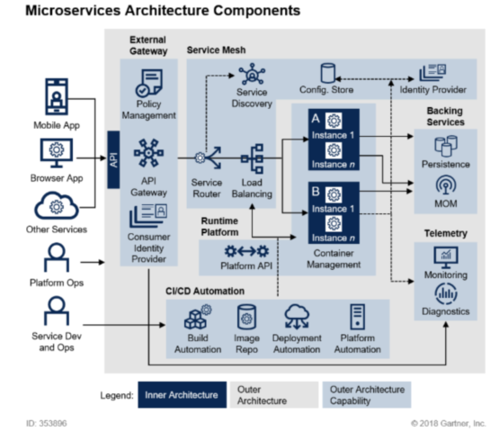

# SpringCloudMSA
spring cloud를 이용하여 MSA를 개발해보자  

> 목차

1. [MSA란 무엇일까?](#msa란-무엇일까)  
 1-1. [Monolith vs MSA](#monolith-vs-msa)  
 1-2. [MSA 표준 구성요소](#msa-표준-구성요소)
2. [Cloud Native Architecture의 이해](#cloud-native-architecture-의-이해)
3. [Cloud Native Application의 이해](#cloud-native-application-의-이해)
4. [SOA와 MSA차이](#soa와-msa차이)
5. [RESTful Web Service](#restful-web-service)

<!--
- 마이크로 서비스 특징
- 자바와 프레임워크인 스프링을 이용하여 MSA를 개발
- 스프링 클라우드 개념
- 스프링 부트와 스프링 클라우드 프레임워크를 활용하여 MSA를 개발하는 방법
- 클라우드 네이티브
- 클라우드 인프라에서 운영하기 위해 필요한 핵심적인 개념
- 컨테이너 가상화 기술인 도커에 배포예정-->

#
 

<!--------------------- 1. MSA란 무엇일까 ---------------------------------------->
# MSA란 무엇일까

 

<!--------------------- 1-1.  Monolith vs MSA---------------------------------------->

# Monolith vs MSA

어플리케이션을 개발하기 위해서는 여러가지 방법론들이 존재한다.  

### ✔ Monolith 방식 (기존에 많이 사용하는 방식)  
 - DATABASE로직, 비지니스 로직, 프론트 등 모든 것이 하나로 연결되어 패키징 되어있는 방식이다.
 - 어플리케이션 안에서 제공되는 각각의 서비스(ex. 가입, 주문, 결제 등..)들은 하나로 묶여서 배포된다.
 - 연결된 DATABASE 역시 하나의 DATABASE안에 모든 테이블들이 존재한다.
  
❗ 단점  
  - 수정사항이 하나라도 있을 시에 프로젝트 전체를 다시 빌드-테스트-배포
  - 오류 발생시 어플리케이션 전체가 다운되어버리는 현상이 발생되기도 한다.

### ✔ MSA 방식 

MSA(Microservice Architecture)는 [클라우드 네이티브 아키텍쳐](#cloud-native-architecture-의-이해)의 핵심 요소 중에 하나이다.

 - 쪼개진 서비스들의 묶음들이 하나의 application을 구성한다. (http 통신)
 - 비지니스들을 중심으로 구축되어야하며 자동화된 배포시스템을 가져야한다 (CI/CD)
 - 수정 배포시에 다른서비스에 영향을 주지않거나 최소한으로 영향을 줌
 - 쪼개진 서비스들은 서로 다른 언어와 서로 다른 database를 가질 수 있다.
 - 설정정보는 외부에 두어 관리하는 것을 권장
 - DB가 다를경우 kafka 메세징 서비스를 이용하여 동기화 가능.  
   어떠한 데이터 등록 -> 그 데이터에 관심이 있다고 등록(서브 스크라이버)을 한 객체에 데이터를 배달해주는 서비스 -> 그리고 자신의 데이터에 등록

 

<!--------------------- 1-2.  MSA 표준 구성요소---------------------------------------->

# MSA 표준 구성요소

1. 클라이언트나 다른 서비스들은 External Gateway(진입점)을 통해서 필요한 서비스를 요청을 한다.
2. 요청은 Service Router로 전달이 되고, 서비스들이 등록되어있는 Service Discovery를 통하여 서비스 위치를 검색한다.
3. 여러개의 분산된 서버로 구성이 되어있다면 Load Balancing을 통하여 어떤 서비스로 보내질지 결정이 된다.
4. 마이크로 서비스는 컨테이너 가상화 기술(Container Management)을 통하여 구성되어있다.
5. CI/CD를 통하여 외부에있는 시스템에 배포 진행시 DevOps 관리자가 존재한다.
6. Backing Services에는 Persistence(저장스토리지를 모아서 사용)와 MOM(메세징 처리 시스템을 통하여 서비스들을 연결시켜줌)이 존재한다.
7. Telemetry에는 모니터링(Monitoring)과 진단기능(Diagnostics)을 가지고있다.

* 환경설정의 경우 외부시스템(Congif Store)에 저장한다.

 
<!--------------------- 2. Cloud Native Architecture 의 이해 ---------------------------------------->

# Cloud Native Architecture 의 이해

**"Cloud Native Architecture란 클라우드 환경의 장점을 활용하여 서비스를 구축하는 것"**

### 😐 클라우드 네이티브 아키텍쳐 도입 전 방식
 - 물리적 하드웨어 성능에 따라서 애플리케이션 서비스 제공
 - 서버가 고정되어 있으니 서버의 증축이나 환경설정 변경이 어려움
 - 물론 지금도 이렇게 서비스를 운영하는 곳은 많음
   
➡ 그래서 탄력적으로 사용할 수 있도록 도입된게 클라우드 환경이다.

### 🥰 클라우드 네이티브 아키텍쳐 특징
 - 리소스를 유연하게 사용 가능함 (가상의 서버, 스토리지, 네트워크를 사용한 만큼 비용처리)
 - 시스템 확장이 유연함. 더 많은 사용자 요청을 처리 가능. 시스템 부하를 분산시킴
 - 컨테이너 기반 패키지
 - 분리되어 개발된 서비스를 CI/CD 자동화 파이프라인을 통해서 서비스 생성-통합-배포 시간을 단축
 - MSA 서비스 구조 (서비스들의 종속성을 최소화 하도록 하자)
 - 디스커버리 서비스에 등록되고 삭제된다.
 - 특정 서비스에 오류가 발생해도 다른 서비스에 영향을 최소화한다.
  
 

<!--------------------- 3. Cloud Native Application 의 이해 ---------------------------------------->

# Cloud Native Application 의 이해

**"Cloud Native Architecture 환경에 의해 설계되고 구현된 어플리케이션"**

클라우드 네이티브 어플리케이션 특징

DevOps

 

- 개발조직과 운영조직의 통합.  
- 오류 개선사항을 필요할 때마다 바로바로 수정 반영할 수 있도록 한다.  
- 서비스의 구조를 작게 분할하여 더 자주 테스트, 배포할 수 있도록 한다.  
- 구현-테스트-배포 시스템 종료될때까지 반복 (문제 발생시 바로 재 배포하는 과정을 반복 가능)

CI/CD

 

- CI(지속적인 통합. Jenkins, Team CI, Travis CI)  
- CD(지속적인 배포. 카나리 배포 블루그린 배포)  

Container 가상화

 

- 전통적인 방식 : 하드웨어 위에 OS를 설치하고 Application들을 운영함  
- 가상머신 방식 : OS위에 Hypervisor기술을 통하여 각각의 가상머신을 기동. (하드웨어를 쪼개서 사용하는 방식)  
- 컨테이너 가상화 방식 : OS위에 컨테이너(Docker)를 이용하여 Application들을 운영  

Microservices

 
하나의 서버에 하나의 서비스를 올리고 그 서비스들이 모여서 Application을 이룬다.

 

<!--------------------- 4. SOA와 MSA차이 ---------------------------------------->

# SOA와 MSA차이

서비스를 지향한다는 점에서 공통점이 있다.  
서비스 공유를 어디까지 하느냐에 따라 달라지게 된다.  

### ✔ SOA (Service Oriented Architecture)
- 서비스 공유 최대화
- 서비스 재사용을 통하여 비용 절감을 중점으로 둔다.
- 엔터프라이즈 서비스 버스(ESB)라는 개념을 통하여 서비스를 한대 모아서 비지니스를 제공함
- Web Services를 통하여 제공 : WSDL(XML 기반 서비스 설명하는 표준 스팩)
- REST / SOAP 등으로 통신

### ✔ MSA (Microservice Architecture)
- 서비스 공유 최소화
- 서비스의 결합도를 낮추어 변화에 능동적으로 대응한다는것에 중점을 둔다.
- REST API를 통하여 데이터나 서비스에 접근가능
- [위에 정리해둔 내용..](#msa란-무엇일까)

 

<!--------------------- 5. RESTful Web Service ---------------------------------------->

# RESTful Web Service

- LEVEL 0 : 가장 간단한 URI 매핑한 상태
- LEVEL 1 : 리소스를 URI로 적절하게 나타내는 상태 ex) https://server/users/2
- LEVEL 2 : LEVEL1 + HTTP METHOD (리소스를 CRUD 용도에 맞게 설계함, get/post/put/delete)
- LEVEL 3 : LEVEL2 + HATEOAS (다음 호출에 대한 정보를 넘겨줌)

